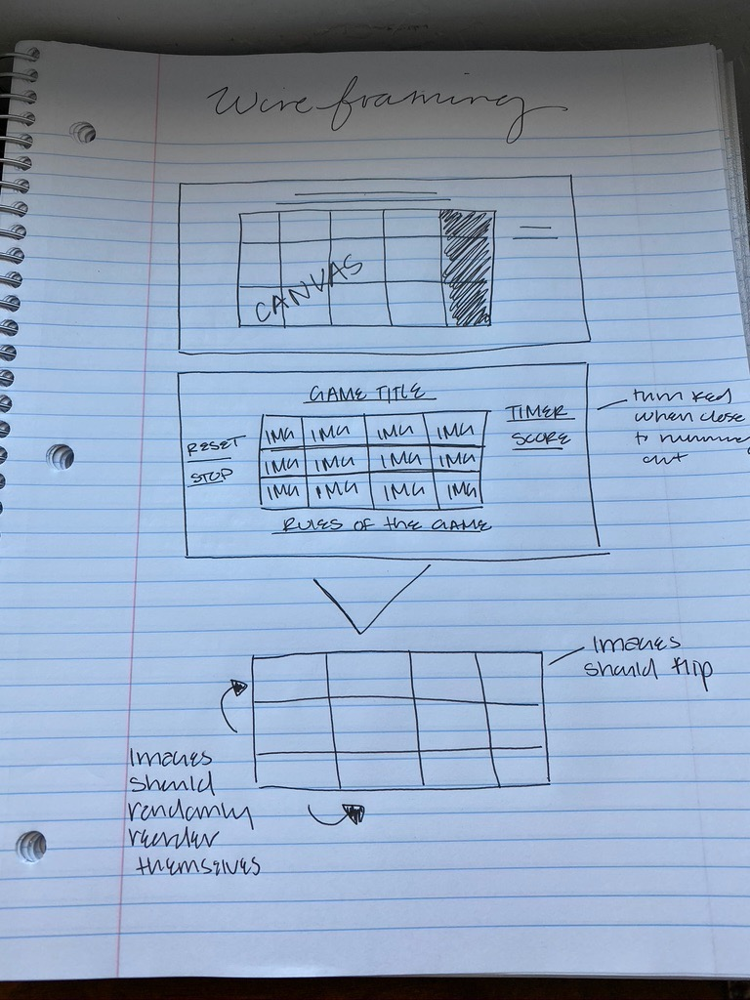

## Meme-memory 

## MVP 

- [x] the ability to select two boxes in one time frame 
- [X] the boxes should reset after two are selected 
- [X] using a grid/canvas 
- [X] players score should update as they select "correct" boxes
- [X] ability to track and render "correct" selections/boxes
- [x] have two players
- [X] have a timer that will countdown from x amount of minutes to add pressure for the player
- [x] one player goes at a time
- [ ] reset the scoreboard 
- [ ] add animations for each player 

## Stretch Goals 

- [ ] having the boxes randomize each new turn 
- [X] using images for each square 
- [ ] using some of the newer frameworks/technology that we learned in the last week
- [ ] keep track of players "personal best" time/score 
- [ ] have the animations respond during gameplay 

## Game-logic

- [X] function to checkWin
- [ ] function for time interval
- [ ] function for resetting the game
- [X] function for resetting the boxes after two are selected 
- [ ] function to print score results
- [ ] function to print winning player
- [ ] function to recognize which player is playing 
- [ ] function to reset the scoreboard so that the two players can start another round

## Technology

- [X] html
- [X] CSS
- [ ] bootstrap?
- [ ] jQuery
- [ ] canvas to hold the game 

## Foreseeable bugs 

- [ ] not being able to randomize the boxes
- [ ] having to determine the winning condition to match the 
- [ ] going down a rabbithole with making sure the boxes are aligned appropriately 
- [ ] having difficulty with aligning the eventlisteners and the ability to restart the game/refresh the boxes
- [ ] unable to find licensing for pictures that I want to use? 

## Citations 

- [ ] wanted to use rainbow text, so I followed the code from this site https://w3bits.com/rainbow-text/
- [ ] Timer citation https://stackoverflow.com/questions/41632942/how-to-measure-time-elapsed-on-javascript/41633001#:~:text=The%20time%20origin%20is%20a,of%20the%20current%20document's%20lifetime.&text=var%20seconds%20%3D%200%3B%20setInterval(,a%20variable%20counting%20seconds%20elapsed.

- [ ] logic research https://marina-ferreira.github.io/tutorials/js/memory-game/
- [ ] research https://medium.com/@adamichelllle/building-a-memory-matching-game-in-javascript-48e792c7b563
- [ ] research https://github.com/sandraisrael/Memory-Game-fend/blob/master/js/app.js
- [ ] https://stackoverflow.com/questions/41632942/how-to-measure-time-elapsed-on-javascript/41633001#:~:text=The%20time%20origin%20is%20a,of%20the%20current%20document's%20lifetime.&text=var%20seconds%20%3D%200%3B%20setInterval(,a%20variable%20counting%20seconds%20elapsed.